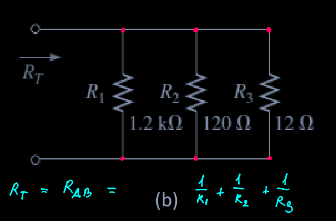
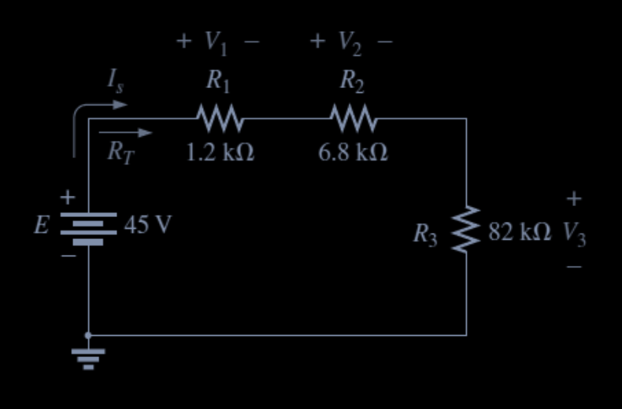

# Lab 3 - Kirchhoff's Laws, Series Parallel and Resistive Circuit

## Question 1 

Find the total resistance $R_T$ for each of the following circuits:

  

$R_T = T_{AB} = R_1 + R_2 + R_4 = 1.2 \Omega + 2.7 \Omega + 8.2 \Omega = 12.1 \Omega$

  

$R_T = R_{AB} = \left( \frac{1}{R_1} + \frac{1}{R_2} + \frac{1}{R_3} \right)^{-1}$

$\left( \frac{1}{1.2 \times 10^3} + \frac{1}{120} + \frac{1}{12} \right)^{-1} = 0.0925^{-1} = 10.81 \Omega$

## Question 2

  

1. Without calculation, quickly estimate which resistor will have the most voltage across? Which resistor will have the most impact on the total resistance and the resulting current?

  -  
