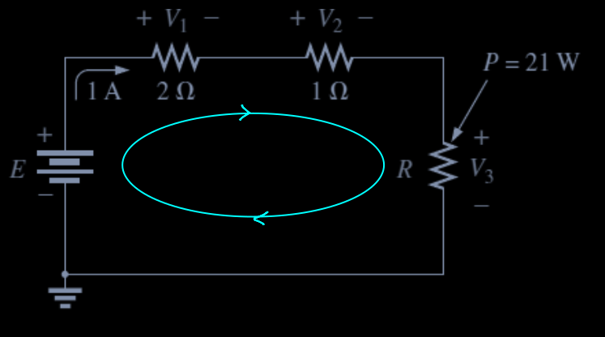
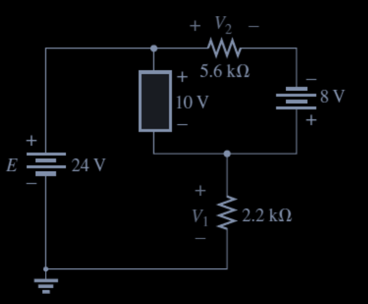

# Lab 3 - Kirchhoff's Laws, Series Parallel and Resistive Circuit

## Problem 1 

Find the total resistance $R_T$ for each of the following circuits:

  

$R_T = T_{AB} = R_1 + R_2 + R_4 = 1.2 \Omega + 2.7 \Omega + 8.2 \Omega = 12.1 \Omega$

  

$R_T = R_{AB} = \left( \frac{1}{R_1} + \frac{1}{R_2} + \frac{1}{R_3} \right)^{-1}$

$\left( \frac{1}{1.2 \times 10^3} + \frac{1}{120} + \frac{1}{12} \right)^{-1} = 0.0925^{-1} = 10.81 \Omega$

## Problem 2

  

> a. Without calculation, quickly estimate which resistor will have the most voltage across? Which resistor will have the most impact on the total resistance and the resulting current?

- $R_1, R_2, R_3$ is connected in a serial network thus having the same `current` flows through each `branch`. Therefore, `voltage` is proportional to $R$ and thus the larger $R$ to larger the electrical potential `=>` $R_3$ has the largest Ohm

> b. Calculate the total resistance

- $R_T = R_1 + R_2 + R_3 = 1.2k \Omega + 6.8k \Omega + 82k \Omega = 90k \Omega$

> c. The current $I_S$

- $I_S = \frac{V_S}{R_T} = \frac{45}{90 \times 10^3} = 0.5 \times 10^{-3} A$

> d. The `voltage` across each `resistor`

- $V_i = I_S \times R_i$ thus $V_1 = 0.6 V, V_2 = 3.4 V, V_3 = 41 V$

> e. The power delivered by the source and the power consumer by the resistor $R_3$

- Electrical power is calculated using the formula: $P = V \times I$
- Power of the source: $P_S = V_S \times I_S = 45V \times 0.5 mA = 22.5 mW$
- Power consumed by $R_3$: $P_{R_3} = V_3 \times I_3 = R_3 \times I_3^2 = 82k \Omega \times (0.5 mA)^2 = 20.5 mW$

## Problem 3

  

> Find the unknown quantities for the following circuit

On observation, $R_1, R_2, R_3$ is connected in a serial network and thus the `current` flows through them from the source is the same and equals to 1A ($I_S = I_1 = I_2 = I_3 = 1A$)
  1. $V_1 \text{ and } V_2$ can be calculated using the formula [Ohm's law](LEC_02.md#3-ohms-law): $V = I \times R; V_1 = 2V; V_2 = 1V$
  2. $P_3$ can be calculated using [electrical power formula](LEC_02.md#11-electrical-power): $P_3 = V_3 \times I_3 = R_3 \times I_3^2$ `=>` $V_3 = \frac{P_3}{I_S} = 21 V; R_3 = \frac{P_3}{I_S^2} = 21 \Omega$
  3. $E$ can be calculated using [KVL](LEC_03.md#21-kirchhoffs-voltage-law-kvl) $E = \sum v_i$ thus $E = V_1 + V_2 + V_3 = 24V$

## Problem 4

  

