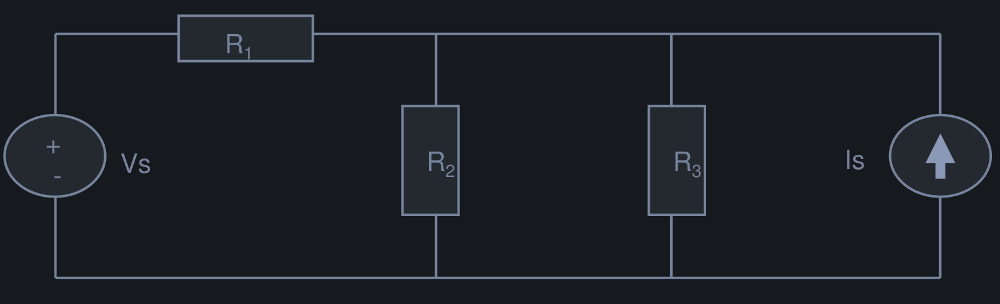

# Lecture 3 - Electric Circuit & Kirchhoff's Laws

- **Reference:** Chapter 6, 7 of [Introductory Circuit Analysis](/server/archive/circuits/introductory.epub)
- **Recap:** [Power, Energy, and Ohm's Law](./w2-ohms_law.md#4-summary)

  
<b>Table of Contents</b>

- [Lecture 3 - Electric Circuit & Kirchhoff's Laws](#lecture-3---electric-circuit--kirchhoffs-laws)
  - [1. Electric Circuits](#1-electric-circuits)
    - [1.1 Circuit Devices (Electric circuit)](#11-circuit-devices-electric-circuit)
      - [1.1.1 Electrical Sources](#111-electrical-sources)
      - [1.1.2 Electrical Devices](#112-electrical-devices)
    - [1.2 Circuit Node (point)](#12-circuit-node-point)
    - [1.3 Circuit Branch](#13-circuit-branch)
    - [1.4 Circuit Loop](#14-circuit-loop)
    - [1.5 Serries and Parallel Circuits](#15-serries-and-parallel-circuits)
      - [1.5.1 Serial Circuits](#151-serial-circuits)
      - [1.5.2 Parallel Circuits](#152-parallel-circuits)
      - [1.5.3 Resistors in Series](#153-resistors-in-series)
      - [1.5.4 Resistors in Parallel](#154-resistors-in-parallel)
  - [2. Kirchhoff's Law](#2-kirchhoffs-law)
    - [2.1 Kirchhoff's Voltage Law (KVL)](#21-kirchhoffs-voltage-law-kvl)
    - [2.2 Kirchhoff's Current Law (KCL)](#22-kirchhoffs-current-law-kcl)
- [Footnote](#footnote)

## 1. Electric Circuits

- **Applications:**
  1. [Electric power systems](https://en.wikipedia.org/wiki/Electric_power_system)
  2. [Printed Circuit Board](https://en.wikipedia.org/wiki/Printed_circuit_board)
  3. [Integrated Circuit](https://en.wikipedia.org/wiki/Integrated_circuit)

- Electric circuit is the combination of at least one:
  - `electrical source` (e.g. voltage source)
  - `electrical device` (e.g resistors, capacitors, inductors, semiconductors, etc) and wire connection

  

### 1.1 Circuit Devices (Electric circuit)

- Circuit device can be either `electrical source` or `electrical device`
- Each circuit device has a voltage across its terminals and a current passing through it
- The `polirity` of the voltage and the `direction` of the `current` passing through the device are important information

  

#### 1.1.1 Electrical Sources

- **Voltage source** is denoted with its `voltage value` and `polarity`
- **Current source** is denoted with its `current value` and `direction`
- The voltage/current source's value is *unchanged* (intact)

  

#### 1.1.2 Electrical Devices

- To analyze the circuit operation, we need to identify all the `voltage` and `current` associated with each `electrical device`
- Since `voltage polarity` and `current direction` is often not known `=>` **assumption** is needed

> [!TIP]
> If the calculated voltage/current is `(+)` then the actual voltage/current is the *same* as the assumed ones, and vice versa

### 1.2 Circuit Node (point)

- A `circuit node` is any point where 2 or more `circuit devices` are connected together
- `Wires` usually have *negligible resistance* *(can be considered as ONE node)*
- Each `node` has one `electric potential` (voltage value with respect to *ground*)

  

### 1.3 Circuit Branch

A `circuit branch` is a `circuit device` between two nodes

> [!TIP]
> The number of `circuit branches` is **equal** to the number of `circuit devices`

### 1.4 Circuit Loop

A circuit `loop` is a collection of `branches` that form a ***closed path*** - returning to the same `node` without going through any other `nodes` or `branches`

### 1.5 Serries and Parallel Circuits

#### 1.5.1 Serial Circuits

- Two devices are ***in series*** if they have **one** `node` in common and have the **same** `current`
- ***A series network has*** several devices **in series** having the same `current` running through them

  

#### 1.5.2 Parallel Circuits

- Two devices are ***in parallel*** if they have **two** `nodes` in common
- ***A parallel circuit has*** several devices **in parallel** having the same `voltage` across their terminals

  

#### 1.5.3 Resistors in Series

  

- The total **resistance** of a ***series configuration*** is the sum of the `resistance` of each `branch`

[^1] *Resistors in series*
[^1]:Resistors in series

$$R_T = R_{ab} = R_1 + R_2 + \cdots + R_N$$

  - $R_T$ is the **total resistance**
  - $R_i (i = 1, 2, \cdots , N)$ is the resistance of the $i^{th}$ `branch`

#### 1.5.4 Resistors in Parallel

  

- The total **resistance** of a ***parallel configuration*** circuit is inverse sum of the `resistance` of each `branch`

[^2] *Resistors in parallel*
[^2]:Resistors in parallel

$$\frac{1}{R_T} = \frac{1}{R_{AB}} = \frac{1}{R_1} + \frac{1}{R_2} + /cdots + \frac{1}{R_N}$$

  - $R_T$ is the **total resistance**
  - $R_i (i = 1, 2, /cdots , N)$ is the resistance of the $i^{th}$ `branch`

## 2. Kirchhoff's Law

**Kirchhoff's circuit laws** are two **equalities** that deal with the `current` and `voltage` in the `lumped element model` of a electrical circuit - [Wikipedia](https://en.wikipedia.org/wiki/Lumped_element_model)

### 2.1 Kirchhoff's Voltage Law (KVL)

`KVL` is the law of conservation of `electrical energy`:
  - **Electrical energy** can neither be *created* nor *destroyed*. Only *transferred* from one point to another
  - The **algebraic sum** $\sum$ of `voltages` around a `loop` is ***zero***
  - In a `loop`, for certain direction:

  [^3] *Kirchhoff's Voltage law*
  [^3]:Kirchhoff's Voltage law

  $$\sum voltage rise - \sum voltage drop = 0$$

  - **Voltage rise:** Electrical potential (respect to ground) changes from `(-)` to `(+)`
  - **Voltage drop:** Electrical potential (respect to ground) changes from `(+)` to `(-)`

  

> [!TIP]
> To apply KVL:
> - Select the `loop` and assume a ***direction*** (e.g. Clockwise)
> - Identify or assume all devices' `voltage polarity`
> - Write the KVL:
>   
>     $$E - V_1 - V_2 = 0$$

### 2.2 Kirchhoff's Current Law (KCL)

`KCL` is the conservation of `charge`:
  - **charges** can neither be *created* nor *destroyed*, only ***move from*** one to another point
  - The **algebraic sum** $\sum$ of all `currents` entering a `node` is **equal** to the um of all `currents` leaving the `node`
  - `KCL` holds for every `node` in a network at **every point in time**

  [^4] *Kirchhoff's Current Law*
  [^4]:Kirchhoff's Current Law

  $$\sum currentsin - \sum currentsout = 0$$

  

> [!TIP]
> To apply KCL:
> - Select the node and **identify/assume** all `currents` entering or leaving that `node`
> - Write the KCL:
> 
>     $$I_1 + I_2 + I_3 - I_4 - I_5 = 0$$

# Footnote

