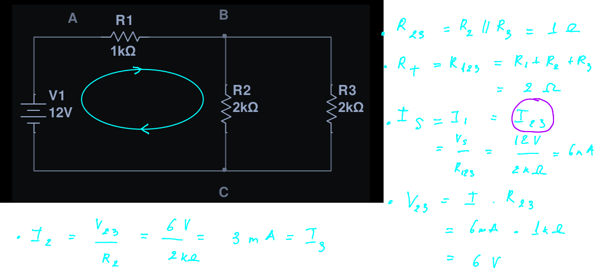
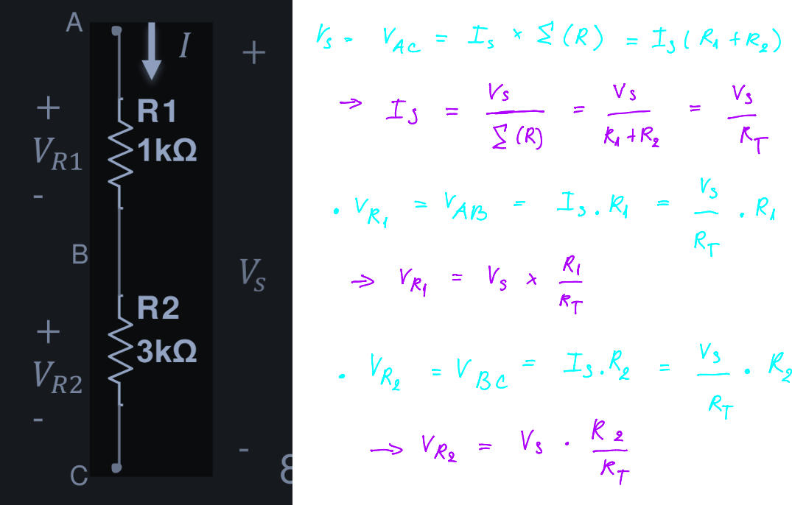
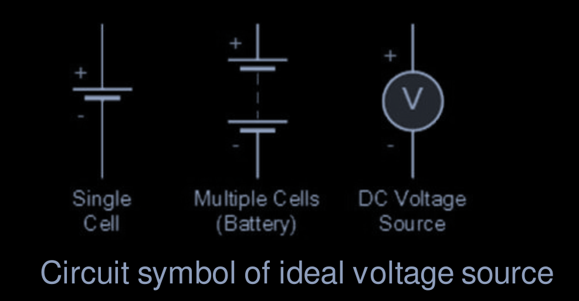
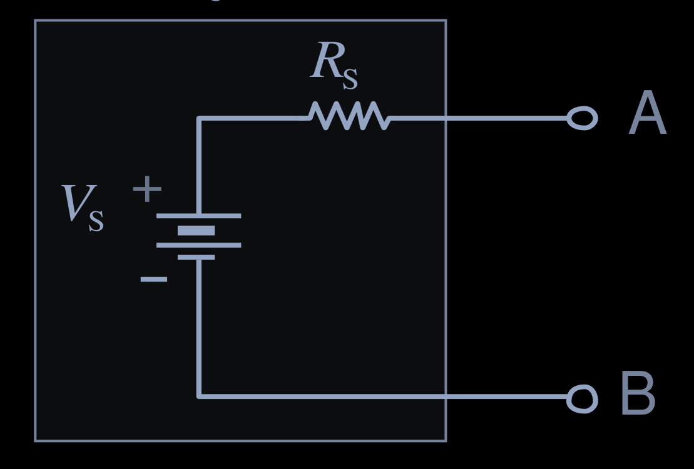

# Lecture 4 - DC Circuit Analysis Methods

- **Reference:** Chapter 7,8 of the book [Introductory Circuit Analysis](/server/archive/circuits/introductory.epub)

## 0. Resistive Circuit

A circuit that contains only a pure resistance (ohms) in an AC circuit is called a Purely Resistive AC Circuit. From a technical standpoint, this circuit does not contain capacitance or inductance

## 1. Circuit Simplification for Resistive Network

- This method is normally applied for the [resistive circuit](#0-resistive-circuit) with only one electrical source
- The *series* or *parallel* network between two nodes can be represented by one equivalent resistance
- Applying [Ohm's Law](./LEC_02.md#3-ohms-law) to find the current of the series network or the voltage of parallel network

  
<b>Example</b>

    

      
    

## 2. Voltage Divider Rule

For the **series network** between two `nodes`, `voltage` of every `resistor` is calculated:

[^1] *Voltage Divider Rule*
[^1]:Voltage Divider Rule

$$V_{Ri} = V_s \times \left ( \frac{R_i}{R_T} \right )$$

  - $V_S$ is the `voltage` between two `nodes`
  - $R_i$ is the **resistance** of `resistor` $i$
  - $R_T$ is the total **resistance** of the *series network*

> [!NOTE]
> Polarity of $V_{Ri}$ and $V_S$ are the same

  
<b>Example</b>

  

## 3. Current Divider Rule

For the **parallel network** between two `nodes`, `current` of every `resistor` is calculated as:

[^2] *Current Divider Rule*
[^2]:Current Divider Rule

$$I_{Ri} = I_S \times \left(\frac{R_T}{R_i} \right)$$

  - $I_S$ is the total `current` going to the *parallel network*
  - $R_i$ is the **resistance** of `resistor` **i**
  - $R_T$ is the total **resistance** of the *parallel network*

  > [!NOTE]
  > Direction of $I_{Ri}$ and $_S$ are the same

  
<b>Example</b>

  

## 4. Voltage and Current Sources

An ideal sources is powerful enough to maintain constant voltage / current as its output regardless of the flow from the source

### 4.1 Ideal DC Voltage Source

An **ideal** *DC voltage source* is powerful enough to maintain constant `voltage` at its output regardless of the `current` flowing through the `source`

> [!IMPORTANT] 
> Two voltage sources of different voltage rating cannot be placed in parallel (violation of [KVL](./LEC_03.md#21-krichhoffs-voltage-law-kvl)

  

### 4.2 Practical DC Voltage Source

A **practical** voltage source consists of an ideal source *in series with* the source resistance $R_S$

  

> [!NOTE]
> For an ideal voltage source the $R_S = 0 \Omega$ 

# Footnote

