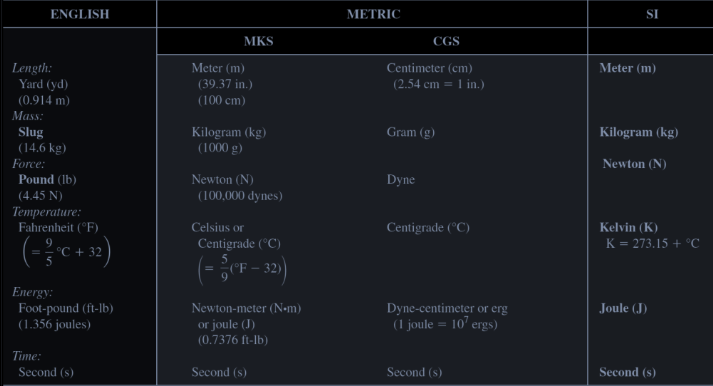
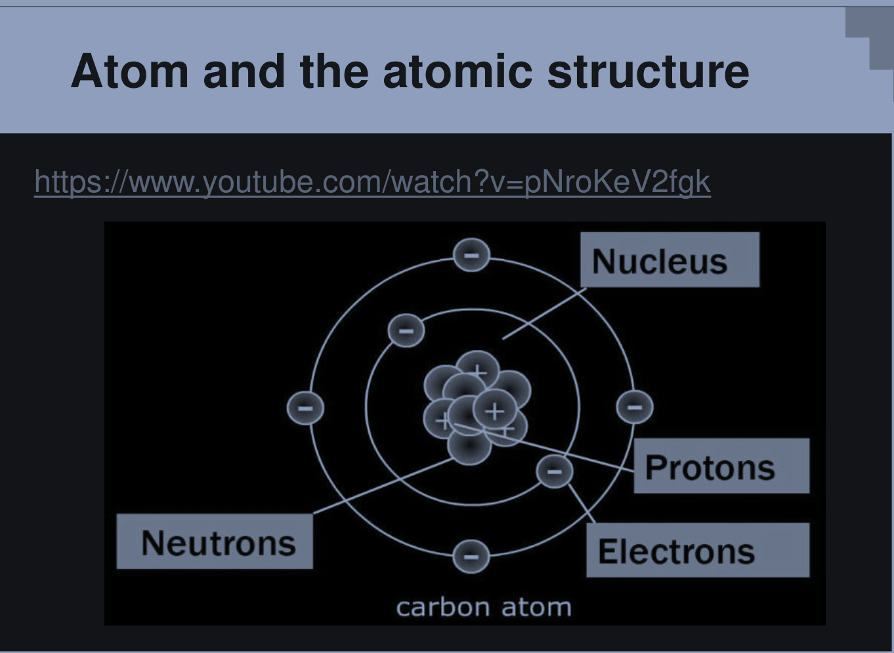
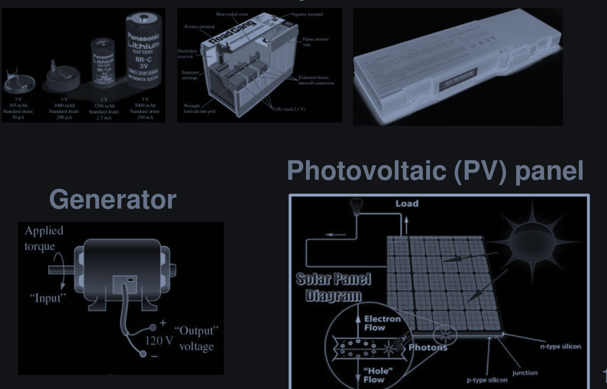

# 1. Units & Number display

## 1.2 Units of Measurement

- **A dummy case**
  - A car runs 200 `kilometers` East for 3 hours
  - I walk 200 `meters` East in 3 minutes

- In engineering, each quantity must have its unite information
- Some quantities have *no unit* (dimensionless quantities): $\pi, e$, etc.
- The numerical value substituted into an equation must have the unit of measurement specified by the equation

  
<b>Example</b>

  $$v = \frac{d}{t}$$

  Where $v$ is the speed, $d$ is distance, and $t$ is for time

- **System of Units**

  

> [!NOTE]
> This course uses **The SI unit measurement system**

# 2. Electrical Quantities

## 2.1 Atom and Electric charge

### 2.1.1 Atomic structure

  

### 2.1.2 Electrical Charges

> [!NOTE]
> - All objects are made of atoms. Two types of charges in atoms: **POSITIVE** & **NEGATIVE**
> - Basic carrier of `(+)` charge is `proton`
> - Basic carrier of `(-)` charge is an `electron`
> - same charges *repel* whereas opposite charges *attract*
> - `protons` do not move from one atom to another
> - `electron` **at the outermost shell of the atom**, when gains enough energy, can leave that atom and become a **free** electron
> - `free electron` can move in the material from one atom to another. Gaining/Losing `electron` is how an object becomes negatively/positively charged
> - **Objects often are neutrally charged**

- The SI (international System of Units) unit of a charge is **Coulomb (C)**
- **A minimal charge is** $e = 1.6 \times 10^{-19}$ C (charge of one electron or proton)
- **All charges are multiples of the minimal charge**

#### 2.1.2.1 Electric Field

- A charge `q` is creates **electric field** $|\vec{E}| = k \cdot \frac{q}{r^2}$ 
- wheres $k = 9 \times 10^9 (Nm^2/C)$
- **Positive charges:** $|\vec{E}|$ is from the `charges` to `infinity`
- **Negative charges:** $|\vec{E}|$ is from `infinity` to the `charge`

#### 2.1.2.2 Electric Force

`Electric fields` ($\vec{E}$) exert `Electric forces` ($\vec{F}$) on other `charge` (q)

$$\vec{F} = \vec{E} \times q$$

`Force` between `charges` according to *Coulomb's Law* in **Newtons (N)**:

$$|{\vec{F}}| = k \cdot \frac{q_1}{r^2}q_2 = E_2 q_1$$

Where:
- k = $9 \times 10^9 (Nm^2 / C^2)$
- $q_1$ and $q_2$ are `charges` (C)
- $E_1$ and $E_2$ are electric field (N/C) create by $q_1$ and $q_2$
- r is distance between them (m)

#### 2.1.2.3 Electric Potential

- Electric field has **potential nature**
- `Electric potential` (denoted as $\mu$) at a position if an electric field is the work (energy) needed to carry one Coulomb positive charge from a reference position to that position

> [!NOTE]
> - Earth is often chosen as the reference postition

- `Electric potential` is measured in **Volts (V)**

$$\mu_A = \frac{W_A}{q}$$

When $\mu_A$ is electric potential (V) at position A, $W_A$ is work (measured in Joules or J) required to move q charges (C) from a reference position to A

## 2.2 Voltage and Current

### 2.2.1 Voltage

- The `electric potential difference` between two points A and B or *voltage between A and B* (denoted as $V_{AB}$) in an electric field is the energy required to move one Coulomb `(+)` charge from B to A

$$V_{AB} = \mu_A - \mu_B = \frac{W_A}{q} - \frac{W_B}{q} = \frac{W_A - W_B}{q}$$

$$V_{AB} = \frac{W_{B \rightarrow A}}{q}$$

- $W_{B \rightarrow A}$ is `work` (J) required to move q charges (C) from point **B** to point **A**
- The unit of voltage is volt (V)

> [!NOTE]
> - `(+)` charges always move from high to low potential and vice versa

  

