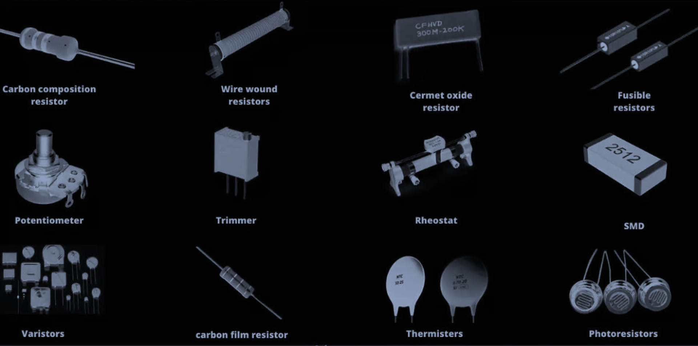
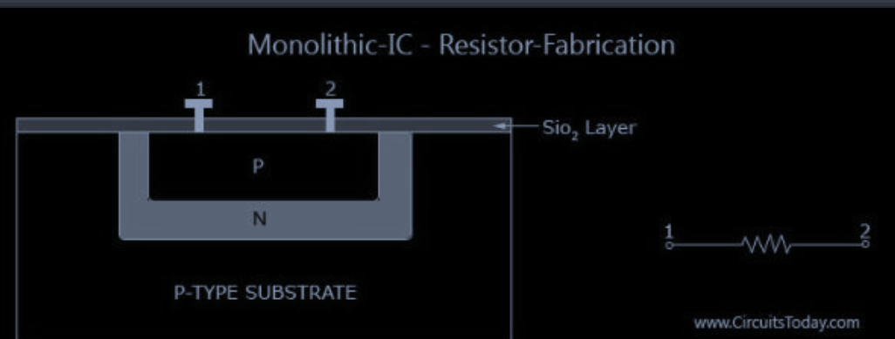
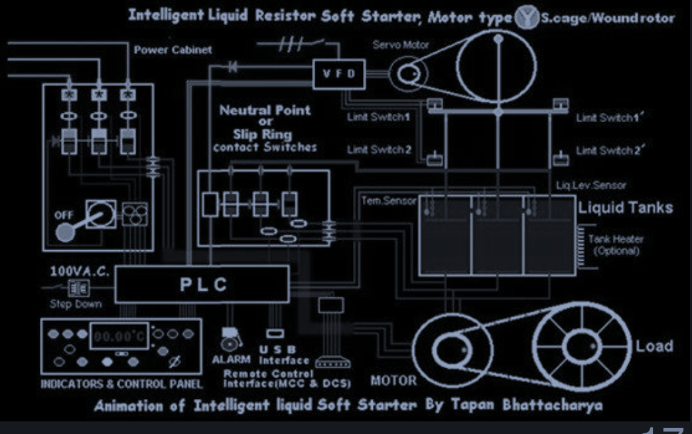
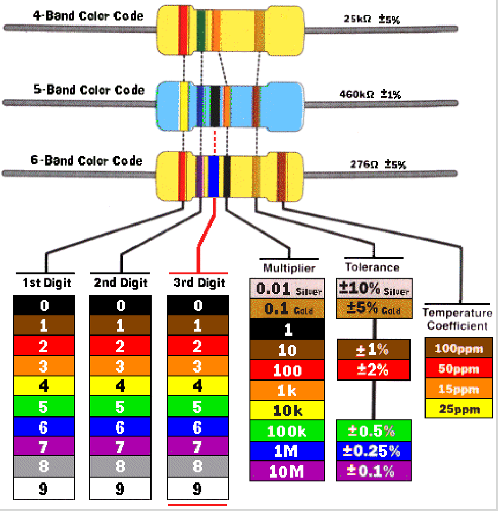

# 1. Power Energy Resistor and Ohm's Law

Book: [Introductory Circuit Analysis](/server/archive/circuits/introductory.epub)

## 1.0 Electric Energy Conversion

*"The first law of thermodynamics state that. Energy can neither be created nor destroyed, it can only be transformed from one to another"*

- In practice, the electric energy is often converted into/from other forms of energy
  - [Light](https://www.youtube.com/watch?v=YjgSRaDaKSM)
  - [Heat](https://www.youtube.com/watch?v=neEvi0AFkcA)
  - [Mechanical](https://www.youtube.com/watch?v=WV2gul2SQNc)

## 1.1 Electrical Power

- Electrical power (P) is the rate of change in electric energy respected to time

[^1] *Electrical power*
[^1]:Electrical power

$$P = \frac{dW}{dt}$$

[^2] *Electrical power*
[^2]: Electrical power

$$P = \frac{W}{t} \text{ if } P = \text{ const }$$

> [!NOTE]
> Q is the total charges passing through the device in time (t)
> $$P = \left(\frac{W}{Q} \right) \cdot \left(\frac{Q}{t}\right)$$
> Thus, $P = V \cdot I$

- Unit of electric power is **Watts (W)**

$$1 \text{ Watt } = \frac{1 \text{Joule}}{1 \text{second}} = 1 \text{Volt} \cdot 1 \text{Ampere}$$

## 1.2 Electric Energy

- Electric energy (E or W) is the electric power consumed or generated over a period of time

$$W = \int P \times t$$

or $E = P \times t$ if P = const

> [!IMPORTANT]
> Unit of electrical energy: Joules (J)
>
> $$1 Joule = 1 Watt \times 1 second$$

## 1.3 Power efficiency

Power efficiency (also called energy transfer efficiency) is ratio of power output to power input of the system/device

Power efficiency is always less than 100% because some energy is always lost in the system (e.g. in the form of heat)

The higher the power efficiency, the better (less wasted energy)

# 2. Resistor

Visit [Ohm's law](#3-ohms-law)
Extra notes: [Different Types of Resistor](#51-different-types-of-resistor)

A resistor is often made of conducting materials with high resistivity *carbon film, nichrome, a copper-nickel-manganese*

Resistor are produced with value varying from **milliohm** (e.g. 0.0002 $\Omega$) to several **tera-ohm** (e.g. 5T $\Omega$ - $10^12 \Omega$)

  

## 2.1 Working mechanism

- Resistors in `Integrated circuit` (IC): fabricated in parallel with the `frabrication` of the `transistor`

  

- High power resistor: liquid Rheostat (Applied in soft-starter of high power induction motor)

  

> [!NOTE]
> Resistor Applications
> 1. Heater
> 2. Light bulb
> 3. Current limitation
> 4. Noise filter
> 5. Amplifier of the signals
> 6. Circuits

## 2.2 Power and Energy consumption

- `Resistor` convert electricity power into heat
- `Power` dissipated by the resistor:

[^4]
[^4]:Consumer power

$$P = VI = \frac{V^2}{R} = I^{2}R$$

   - Where $R(\Omega)$ is resistor's resistance
   - $V$ (V) is voltage
   - $I$ (A) is the current running through the resistor
   - Energy (J) is consumed by the resistor over t (seconds) of time

## 2.3 Characteristic

Resistors are characterized by:
- Power rating (how much power can the device withstand)
- Accuracy
- Temperature coefficient

  

# 3. Ohm's Law

> [!TIP] 
> Visit [Ohm's Law@OENG1205](../../physics/OENG1209/w9-magnetic.md#ohms-law)
> Visit [Mechanical circuits](https://youtube.com/watch?v=QrkiJZKJfpY)

Ohm's law states that:

[^3]
[^3]:Ohm's law

$$I = \frac{V}{R}$$

- $R$ (ohms) is resistor's resistance
- $V$ (volts) is the voltage across two resistor's terminal
- $I$ (amperes) is the current running through the resistor

> [!IMPORTANT]
> Convention:
> - For a `voltage` `(+)` denotes higher electric potential, `(-)` denotes lower electric potential
> - For a `current` $\rightarrow$ denotes the positive current direction (the flow of `(+)` charge)

An object following ohm's law is made of `ohmic material`

# 4. Summary

- Electric energy conversion: Light, Heat, mechanical
- Electric power of a device: [^1] $P = V \times I$
- Electric energy of a device: [^3] $E = P \times t$
- Resistor:
  - Follow [Ohm's law](#3-ohms-law): [^4] $I = \frac{V}{R}$
  - convert electric energy into heat: [^4] $P = RI^2 = \frac{V^2}{R}$
  - Present in component in most of electrical and electronic circuits

# 5. Glossary

## 5.1 Different Types of Resistor

1. **Insulator:** don't let electrons/charges flow through - an insulator acts like rubber between two oppositely charged plates
2. **Conductor:** opposite of `insulator`, it allows electrons to flow through easily
3. **Capacitor:** two oppositely charged plated that are kept apart by space

# 6. Footnote

