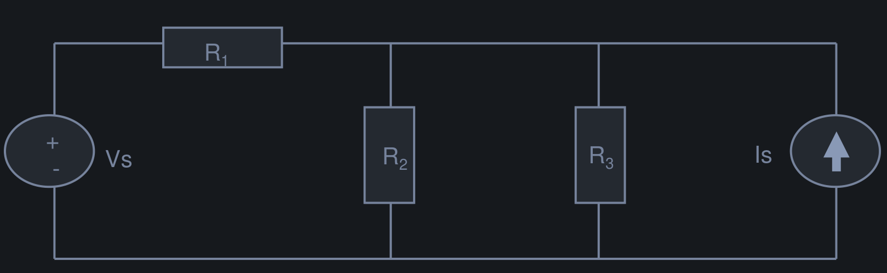

# Lecture 3 - Electric Circuit & Kirchhoff's Laws

**Reference:** Chapter 6, 7 of [Introductory Circuit Analysis](/server/archive/circuits/introductory.epub)

## 1. Electric Circuits

- **Applications:**
  1. [Electric power systems](https://en.wikipedia.org/wiki/Electric_power_system)
  2. [Printed Circuit Board](https://en.wikipedia.org/wiki/Printed_circuit_board)
  3. [Integrated Circuit](https://en.wikipedia.org/wiki/Integrated_circuit)

- Electric circuit is the combination of at least one:
  - `electrical source` (e.g. voltage source)
  - `electrical device` (e.g resistors, capacitors, inductors, semiconductors, etc) and wire connection

  

### 1.1 Circuit Devices (Electric circuit)

- Circuit device can be either `electrical source` or `electrical device`
- Each circuit device has a voltage across its terminals and a current passing through it
- The `polirity` of the voltage and the `direction` of the `current` passing through the device are important information

  

#### 1.1.1 Electrical Sources

- **Voltage source** is denoted with its `voltage value` and `polarity`
- **Current source** is denoted with its `current value` and `direction`
- The voltage/current source's value is *unchanged* (intact)

  

#### 1.1.2 Electrical Devices

- To analyze the circuit operation, we need to identify all the `voltage` and `current` associated with each `electrical device`
- Since `voltage polarity` and `current direction` is often not known `=>` **assumption** is needed

> [!TIP]
> If the calculated voltage/current is `(+)` then the actual voltage/current is the *same* as the assumed ones, and vice versa

### 1.2 Circuit Node (point)

- A `circuit node` is any point where 2 or more `circuit devices` are connected together
- `Wires` usually have *negligible resistance* *(can be considered as ONE node)*
- Each `node` has one `electric potential` (voltage value with respect to *ground*)

  

### 1.3 Circuit Branch

A `circuit branch` is a `circuit device` between two nodes

> [!TIP]
> The number of `circuit branches` is **equal** to the number of `circuit devices`

### 1.4 Circuit Loop

A circuit `loop` is a collection of `branches` that form a ***closed path*** - returning to the same `node` without going through any other `nodes` or `branches`

# 2. Kirchhoff's Law

## Kirchhoff's Voltage Law (KVL)

- `KVL` is the law of conservation of electrical energy:
  - **Electrical energy** can neither be *created* nor *destroyed*. Only *transferred* from one point to another
  - The **algebraic sum** $\sum$ of `voltages` around a `loop` is ***zero***
  - In a `loop`, for certain direction:

  $$\sum voltage rise - \sum voltage drop = 0$$

  - **Voltage rise:** Electrical potential (respect to ground) changes from `(-)` to `(+)`
  - **Voltage drop:** Electrical potential (respect to ground) changes from `(+)` to `(-)`
